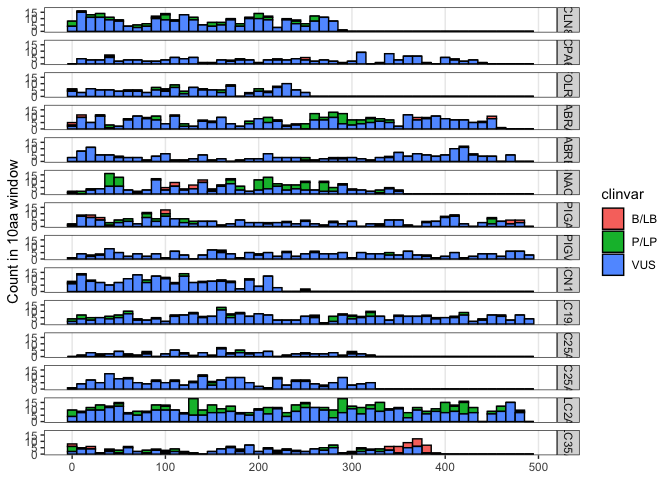
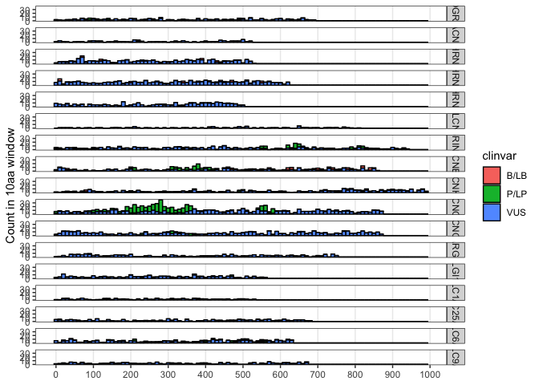
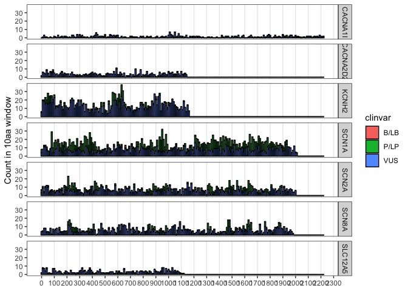

Epilepsy
================
Kenneth Matreyek
2025-06-02

``` r
rm(list = ls())
library(tidyverse)
```

    ## Warning: package 'ggplot2' was built under R version 4.2.3

    ## Warning: package 'tidyr' was built under R version 4.2.3

    ## ── Attaching core tidyverse packages ──────────────────────── tidyverse 2.0.0 ──
    ## ✔ dplyr     1.1.2     ✔ readr     2.1.4
    ## ✔ forcats   1.0.0     ✔ stringr   1.5.0
    ## ✔ ggplot2   3.5.1     ✔ tibble    3.2.1
    ## ✔ lubridate 1.9.2     ✔ tidyr     1.3.1
    ## ✔ purrr     1.0.2     
    ## ── Conflicts ────────────────────────────────────────── tidyverse_conflicts() ──
    ## ✖ dplyr::filter() masks stats::filter()
    ## ✖ dplyr::lag()    masks stats::lag()
    ## ℹ Use the conflicted package (<http://conflicted.r-lib.org/>) to force all conflicts to become errors

``` r
theme_set(theme_bw())
library(googlesheets4)
library(reshape2)
```

    ## 
    ## Attaching package: 'reshape2'
    ## 
    ## The following object is masked from 'package:tidyr':
    ## 
    ##     smiths

``` r
## Importing my existing datatable of manual curation (eg. Uniprot links, cell localization) I made in Google Sheets

newest <- read_sheet("https://docs.google.com/spreadsheets/d/1ZbfJCrhLEpj9M-ujwAQ1vSALtS3y0prrNTXGIXgISSQ/edit?usp=sharing", sheet = "Annotated") %>% select(Gene, Name, Size, Clinvar_missense, Location, Uniprot) %>% distinct()

newest$gene <- ""
for(x in 1:nrow(newest)){newest$gene[x] <- strsplit(newest$Gene[x]," ")[[1]][1]}

## Import data from the NIH genetic testing registry
gtr <- read_sheet("https://docs.google.com/spreadsheets/d/1ZbfJCrhLEpj9M-ujwAQ1vSALtS3y0prrNTXGIXgISSQ/edit?usp=sharing", sheet = "GTR")

gtr_table <- data.frame(table(gtr$Gene)); colnames(gtr_table) <- c("Gene","gtr_count")

## Incorporate curated Epilepsy lists from the literature / scientific resource ecosystem
monarch <- read_sheet("https://docs.google.com/spreadsheets/d/1ZbfJCrhLEpj9M-ujwAQ1vSALtS3y0prrNTXGIXgISSQ/edit?usp=sharing", sheet = "Monarch") %>% mutate("monarch" = 1)

# https://github.com/bahlolab/Genes4Epilepsy
g4e <- read.table(file = "Data/Genes4Epilepsy_EpilepsyGenes_v2024-09.tsv", sep = "\t", header = T) %>% mutate("g4e" = 1)
colnames(g4e)[2] <- "gene"

# Chi et al list
chi <- read.table(file = "Data/2024_Chi_Kiskinis_SciRep/Final_list.csv", sep = ",", header = T) %>% mutate("chi" = 1)

# Importing Emma's list for later comparison
emma <- read.csv(file = "Data/Schaffer_lab_info/ASDCrossOver.csv", header = T)

emma_sfari <- data.frame("gene" = emma$Gene..SFARI., "sfari" = 1) %>% filter(gene != "")
emma_epilepsy <- data.frame("gene" = emma$Gene..CZI., "epilepsy" = 1) %>% filter(gene != "")
colnames(emma_epilepsy)[2] <- "emma"
```

``` r
combined1 <- merge(newest, gtr_table, by = "Gene", all = T)
combined1$clinvar_ratio <- round(as.numeric(combined1$Clinvar_missense) / as.numeric(unlist(combined1$Size)),2)
combined2 <- merge(combined1 %>% select(!Gene), chi, all = T)
combined3 <- merge(combined2, monarch[,c("gene","monarch")], all = T)
combined4 <- merge(combined3, g4e[,c("gene","g4e")], all = T)
combined5 <- merge(combined4, emma_epilepsy, all = T) %>% distinct()

combined5$gene_list_sum <- rowSums(combined5[,c("monarch","g4e","chi")], na.rm = T) #rowSums(combined[,c("emma","monarch","g4e","gtr_2plus","chi")])
combined5 <- combined5 %>% arrange(desc(gene_list_sum), desc(gtr_count))

combined5$inclusion <- (combined5$gene_list_sum == 3)|(combined5$gene_list_sum != 3  & combined5$gtr_count >= 7)

combined5 <- combined5 %>% mutate(glsum_factor = factor(gene_list_sum))

Inclusion_histogram_plot <- ggplot() + theme(panel.grid.minor = element_blank()) + 
  geom_histogram(data = combined5, aes(x = gtr_count), binwidth = 1, fill = "grey90", color = "black") +
  geom_histogram(data = combined5 %>% filter(inclusion == T), aes(x = gtr_count), binwidth = 1, fill = "red", color = "black") +
  facet_grid(rows = vars(glsum_factor), scales = "free_y") +
  labs(x = "Inclusion in testing panel", y = "Number of genes", title = "Red are meeting criteria") +
  NULL; Inclusion_histogram_plot
```

<!-- -->

``` r
ggsave(file = "Plots/Inclusion_histogram_plot.pdf", Inclusion_histogram_plot, height = 4, width = 4)

tested_not_unanimous <- combined5 %>% filter(combined5$gene_list_sum != 3 & combined5$gtr_count >= 7)
unanimous_but_untested <- combined5 %>% filter(combined5$gene_list_sum == 3 & combined5$gtr_count < 2)
```

Next incorporate the list of constructs we had cloned or already made
plans to clone

``` r
cloning <- read_sheet("https://docs.google.com/spreadsheets/d/1ZbfJCrhLEpj9M-ujwAQ1vSALtS3y0prrNTXGIXgISSQ/edit?usp=sharing", sheet = "Epilepsy_cloning")[-1,]
combined6 <- merge(combined5, cloning[,c("gene","Shuttled","Shuttle_count")], all.x = T) %>% distinct() %>% arrange(desc(gene_list_sum), desc(gtr_count))
combined6[is.na(combined6$Shuttle_count),"Shuttle_count"] <- 0
```

## Incorporating the above data to hone in on the final set desired

``` r
target_set <- combined6 %>% filter(inclusion == TRUE | Shuttle_count == 1) %>% arrange(desc(inclusion),desc(Shuttle_count), desc(clinvar_ratio))
target_set[target_set$Size == "NULL","Size"] <- NA
target_set$Size <- as.numeric(unlist(target_set$Size))

target_set2 <- apply(target_set,2,as.character)

Epilepsy_merged_output <- target_set  #[,c("gene","Name","Size","Clinvar_missense","Shuttled","Shuttle_count","Location","intended","emma","gene_list_sum","gtr_count","clinvar_ratio","Uniprot")] 

ss4 <- gs4_create(
  "Epilepsy_merged_output",
  sheets = Epilepsy_merged_output
)

sheet_write(Epilepsy_merged_output, ss4, sheet = "Epilepsy_merged_output")

write.csv(file = "Output/250601_target_gene_list.csv", target_set2, row.names = F)
```

## This next section is importing ClinVar data to figure out what regions of the proteins are best worth mutagenizing

``` r
clinvar_files = list.files(path="ClinVar_mis_non", pattern="*.txt", full.names=TRUE)
clinvar_files_df <- data.frame("number" = seq(1,length(clinvar_files)), "index" = clinvar_files)

clinvar <- read.delim(file = "ClinVar_mis_non/_Headers.tsv", sep = "\t") %>% mutate(gene = NA)

for(x in 1:nrow(clinvar_files_df)){
  temp_name <- strsplit(strsplit(clinvar_files_df$index[x], "/")[[1]][2],".txt")[[1]][1]
  temp_frame <- read.delim(file = clinvar_files_df$index[x], sep = "\t") %>% mutate(gene = temp_name)
  clinvar <- rbind(clinvar, temp_frame) %>% filter(!is.na(gene))
}

for(x in 1:nrow(clinvar)){
  clinvar$variant_3aa[x] <- gsub(")","",substr(strsplit(clinvar$Name[x]," ")[[1]][2],4,12))
}
clinvar$pos <- as.numeric(gsub("[^0-9]","",clinvar$variant_3aa))

clinvar$clinvar <- ""
for(x in 1:nrow(clinvar)){
  if(clinvar$Germline.classification[x] == "Benign"){clinvar$clinvar[x] <- "B/LB"}
  if(clinvar$Germline.classification[x] == "Benign/Likely benign"){clinvar$clinvar[x] <- "B/LB"}
  if(clinvar$Germline.classification[x] == "Likely benign"){clinvar$clinvar[x] <- "B/LB"}
  if(clinvar$Germline.classification[x] == "Pathogenic"){clinvar$clinvar[x] <- "P/LP"}
  if(clinvar$Germline.classification[x] == "Pathogenic/Likely pathogenic"){clinvar$clinvar[x] <- "P/LP"}
  if(clinvar$Germline.classification[x] == "Likely pathogenic"){clinvar$clinvar[x] <- "P/LP"}
  if(clinvar$Germline.classification[x] == "Uncertain significance"){clinvar$clinvar[x] <- "VUS"}
  if(clinvar$Germline.classification[x] == "Conflicting classifications of pathogenicity"){clinvar$clinvar[x] <- "VUS"}
  if(clinvar$Germline.classification[x] == "not provided"){clinvar$clinvar[x] <- "VUS"}
  if(clinvar$Germline.classification[x] == "risk factor"){clinvar$clinvar[x] <- "VUS"}
}

clinvar <- clinvar %>% filter(clinvar %in% c("B/LB","P/LP","VUS"))

small_prot_set <- target_set %>% filter(Size != "NA" & !is.na(Size) & Size <= 500)
clinvar_small_prot <- clinvar %>% filter(gene %in% small_prot_set$gene)

ClinVar_small_prot_histograms <- ggplot() + 
  geom_histogram(data = clinvar_small_prot, aes(x = pos, fill = clinvar), binwidth = 10, color = "black") +
  facet_grid(rows = vars(gene)) + #, scales = "free") +
  scale_x_continuous(breaks = seq(0,500,100)) +
  theme(panel.grid.minor = element_blank(), panel.grid.major.y = element_blank()) +
  labs(x = NULL, y = "Count in 10aa window") +
  NULL; ClinVar_small_prot_histograms
```

<!-- -->

``` r
ggsave(file = "Plots/ClinVar_small_prot_histograms.pdf", ClinVar_small_prot_histograms, height = length(unique(clinvar_small_prot$gene))*0.75, width = 6)


medium_prot_set <- target_set %>% filter(Size != "NA" & !is.na(Size) & Size > 500 & Size <= 1000)
clinvar_medium_prot <- clinvar %>% filter(gene %in% medium_prot_set$gene)

ClinVar_medium_prot_histograms <- ggplot() + 
  geom_histogram(data = clinvar_medium_prot, aes(x = pos, fill = clinvar), binwidth = 10, color = "black") +
  facet_grid(rows = vars(gene)) + #, scales = "free") +
  scale_x_continuous(breaks = seq(0,1000,100)) +
  theme(panel.grid.minor = element_blank(), panel.grid.major.y = element_blank()) +
  labs(x = NULL, y = "Count in 10aa window") +
  NULL; ClinVar_medium_prot_histograms
```

<!-- -->

``` r
ggsave(file = "Plots/ClinVar_medium_prot_histograms.pdf", ClinVar_medium_prot_histograms, height = length(unique(clinvar_medium_prot$gene))*0.75, width = 9)


large_prot_set <- target_set %>% filter(Size != "NA" & !is.na(Size) & Size > 1000)
clinvar_large_prot <- clinvar %>% filter(gene %in% large_prot_set$gene)

ClinVar_large_prot_histograms <- ggplot() + 
  geom_histogram(data = clinvar_large_prot, aes(x = pos, fill = clinvar), binwidth = 10, color = "black") +
  facet_grid(rows = vars(gene)) + #, scales = "free") +
  scale_x_continuous(breaks = seq(0,2300,100)) +
  theme(panel.grid.minor = element_blank(), panel.grid.major.y = element_blank()) +
  labs(x = NULL, y = "Count in 10aa window") +
  NULL; ClinVar_large_prot_histograms
```

<!-- -->

``` r
ggsave(file = "Plots/ClinVar_large_prot_histograms.pdf", ClinVar_large_prot_histograms, height = length(unique(clinvar_large_prot$gene))*0.75, width = 12)
```

## This section is our barcoding preliminary tests

First up is looking at the barcode for the Gibsons using Amp-EZ miSeq
500 cycle sequencing

``` r
g1_barcoding <- read.table(file = "Barcoding/G1_trimmed_tally.csv", sep = ",", header = T) %>% mutate(freq = Count / sum(Count))
g2_barcoding <- read.table(file = "Barcoding/G2_trimmed_tally.csv", sep = ",", header = T) %>% mutate(freq = Count / sum(Count))

g1_linked <- read.table(file = "Barcoding/G1_linked_tally.csv", sep = ",", header = T) %>% mutate(freq = Count / sum(Count)) %>% filter(Count > 1)

g1_linked$nchar <- nchar(g1_linked$Sequence)
g1_linked$barcoded <- "unbarcoded"
g1_linked[g1_linked$nchar == 20,"barcoded"] <- "barcoded"

aez035_g1_histogram <- ggplot() + geom_histogram(data = g1_linked, aes(x = Count), bins = 30, fill = "grey80", color = "black") +
  scale_x_log10() + #geom_vline(xintercept = c(7,300)) +
  facet_grid(rows = vars(barcoded), scales = "free_y") +
  theme(panel.grid.minor = element_blank(), panel.grid.major.y = element_blank()) + 
  labs(title = "AEZ035_G1", x = "Number of reads") +
  NULL; aez035_g1_histogram
```

<!-- -->

``` r
ggsave(file = "Barcoding/Plots/aez035_g1_histogram.pdf", aez035_g1_histogram, height = 3, width = 4)
ggsave(file = "Barcoding/Plots/aez035_g1_histogram.png", aez035_g1_histogram, height = 3, width = 4)

g1_linked_summary <- g1_linked %>% group_by(barcoded) %>% summarize(count_sum = sum(Count)) %>% mutate(freq = count_sum / sum(count_sum))

g1_linked_barcoded <- g1_linked %>% filter(barcoded == "barcoded" & Count > 8)

aez035_g1_filtered_histogram <- ggplot() + geom_histogram(data = g1_linked_barcoded, aes(x = Count), fill = "grey80", color = "black", bins = 20) +
  scale_x_log10() + #geom_vline(xintercept = c(7,300)) +
  theme(panel.grid.minor = element_blank(), panel.grid.major.y = element_blank()) + 
  labs(title = "AEZ035_G1, likely true barcodes", x = "Number of reads") +
  NULL; aez035_g1_filtered_histogram
```

<!-- -->

``` r
ggsave(file = "Barcoding/Plots/aez035_g1_filtered_histogram.pdf", aez035_g1_filtered_histogram, height = 3, width = 4)
ggsave(file = "Barcoding/Plots/aez035_g1_filtered_histogram.png", aez035_g1_filtered_histogram, height = 3, width = 4)


g2_linked <- read.table(file = "Barcoding/G2_linked_tally.csv", sep = ",", header = T) %>% mutate(freq = Count / sum(Count))

g2_linked$nchar <- nchar(g2_linked$Sequence)
g2_linked$barcoded <- "unbarcoded"
g2_linked[g2_linked$nchar == 20,"barcoded"] <- "barcoded"

aez035_g2_histogram <- ggplot() + geom_histogram(data = g2_linked, aes(x = Count), bins = 30, fill = "grey80", color = "black") +
  scale_x_log10() + #geom_vline(xintercept = c(7,300)) +
  facet_grid(rows = vars(barcoded), scales = "free_y") +
  theme(panel.grid.minor = element_blank(), panel.grid.major.y = element_blank()) + 
  labs(title = "AEZ035_g2", x = "Number of reads") +
  NULL; aez035_g2_histogram
```

<!-- -->

``` r
ggsave(file = "Barcoding/Plots/aez035_g2_histogram.pdf", aez035_g2_histogram, height = 3, width = 4)
ggsave(file = "Barcoding/Plots/aez035_g2_histogram.png", aez035_g2_histogram, height = 3, width = 4)

g2_linked_summary <- g2_linked %>% group_by(barcoded) %>% summarize(count_sum = sum(Count)) %>% mutate(freq = count_sum / sum(count_sum))

g2_linked_barcoded <- g2_linked %>% filter(barcoded == "barcoded" & Count > 8)

aez035_g2_filtered_histogram <- ggplot() + geom_histogram(data = g2_linked_barcoded, aes(x = Count), fill = "grey80", color = "black", bins = 20) +
  scale_x_log10() + #geom_vline(xintercept = c(7,300)) +
  theme(panel.grid.minor = element_blank(), panel.grid.major.y = element_blank()) + 
  labs(title = "AEZ035_g2, likely true barcodes", x = "Number of reads") +
  NULL; aez035_g2_filtered_histogram
```

<!-- -->

``` r
ggsave(file = "Barcoding/Plots/aez035_g2_filtered_histogram.pdf", aez035_g2_filtered_histogram, height = 3, width = 4)
ggsave(file = "Barcoding/Plots/aez035_g2_filtered_histogram.png", aez035_g2_filtered_histogram, height = 3, width = 4)

## Now merge both datasets together so that we can see if any barcodes overlap

g1g2_barcoding <- merge(g1_linked_barcoded, g2_linked_barcoded, by = "Sequence", all = T)

g1g2_barcoding$type <- ""
for(x in 1:nrow(g1g2_barcoding)){
  if(!is.na(g1g2_barcoding$Count.x[x]) & is.na(g1g2_barcoding$Count.y[x])){g1g2_barcoding$type[x] <- "G1"}
  if(is.na(g1g2_barcoding$Count.x[x]) & !is.na(g1g2_barcoding$Count.y[x])){g1g2_barcoding$type[x] <- "G2"}
  if(!is.na(g1g2_barcoding$Count.x[x]) & !is.na(g1g2_barcoding$Count.y[x])){g1g2_barcoding$type[x] <- "Both"}
}

table(g1g2_barcoding$type)
```

    ## 
    ## Both   G1   G2 
    ##   34 5439 5095

``` r
g1g2_barcoding_both <- g1g2_barcoding %>% filter(type == "Both")

ggplot() + geom_point(data = g1g2_barcoding, aes(x = Count.x, y = Count.y)) +
  scale_x_log10() + scale_y_log10()
```

<!-- -->

``` r
ggplot() + geom_histogram(data = g1_barcoding, aes(x = Count)) +
  scale_x_log10() + geom_vline(xintercept = c(7,300))
```

<!-- -->

``` r
g1_barcoding_filtered <- g1_barcoding %>% filter(Count > 7 & Count < 300)

ggplot() + geom_histogram(data = g2_barcoding, aes(x = Count)) +
  scale_x_log10() + geom_vline(xintercept = c(5,300))
```

<!-- -->

``` r
g2_barcoding_filtered <- g2_barcoding %>% filter(Count > 5 & Count < 300)

g1g2_barcoding <- merge(g1_barcoding_filtered, g2_barcoding_filtered, by = "Sequence", all = T)

g1g2_barcoding$type <- ""
for(x in 1:nrow(g1g2_barcoding)){
  if(!is.na(g1g2_barcoding$Count.x[x]) & is.na(g1g2_barcoding$Count.y[x])){g1g2_barcoding$type[x] <- "G1"}
  if(is.na(g1g2_barcoding$Count.x[x]) & !is.na(g1g2_barcoding$Count.y[x])){g1g2_barcoding$type[x] <- "G2"}
  if(!is.na(g1g2_barcoding$Count.x[x]) & !is.na(g1g2_barcoding$Count.y[x])){g1g2_barcoding$type[x] <- "Both"}
}

table(g1g2_barcoding$type)
```

    ## 
    ## Both   G1   G2 
    ##   93 5834 5711

``` r
ggplot() + 
  geom_point(data = g1g2_barcoding, aes(x = Count.x, y = Count.y )) +
  scale_x_log10() + scale_y_log10()
```

<!-- -->

``` r
## L062 Gibson data from PSRS125 

l062_psrs125gib <- read.csv(file = "Barcoding/L062_PSRS125_Gibson.csv")
l062_psrs125gib_melt <- melt(l062_psrs125gib, id = "Header"); l062_psrs125gib_melt$count <- 0
l062_psrs125gib_melt[l062_psrs125gib_melt$value >= 1, "count"] <- 1
l062_psrs125gib_melt_sum <- l062_psrs125gib_melt %>% group_by(variable) %>% summarize(count = sum(count))

paste("Roughly",
  round(mean(l062_psrs125gib_melt_sum$count[1:4]) / (mean(l062_psrs125gib_melt_sum$count[1:4]) + mean(l062_psrs125gib_melt_sum$count[5:6]))*100,2),
  "percent of plasmids were successfully barcoded"
)
```

    ## [1] "Roughly 91.31 percent of plasmids were successfully barcoded"

``` r
l062_psrs125gib_barcodes <- read.csv(file = "Barcoding/L062_PSRS125_Gibson_barcodes.csv")
l062_psrs125gib_barcodes_table <- l062_psrs125gib_barcodes %>% group_by(Variable.Region) %>% tally()

paste("Roughly",
  round(nrow(l062_psrs125gib_barcodes_table) / (mean(l062_psrs125gib_melt_sum$count[1:4])*2)*100,2),
  "percent of the ~",
  round(mean(l062_psrs125gib_melt_sum$count[1:4]),0),
  "barcoded plasmid sequences were not repeats"
)
```

    ## [1] "Roughly 81.31 percent of the ~ 368 barcoded plasmid sequences were not repeats"

``` r
## L062 oligo ligation barcoding data from PSRS125

l062_psrs125lig <- read.csv(file = "Barcoding/L062_PSRS125_Ligation.csv")
l062_psrs125lig_melt <- melt(l062_psrs125lig, id = "Header"); l062_psrs125lig_melt$count <- 0
l062_psrs125lig_melt[l062_psrs125lig_melt$value >= 1, "count"] <- 1
l062_psrs125lig_melt_sum <- l062_psrs125lig_melt %>% group_by(variable) %>% summarize(count = sum(count))

paste("Roughly",
  round(mean(l062_psrs125lig_melt_sum$count[1:4]) / (mean(l062_psrs125lig_melt_sum$count[1:4]) + mean(l062_psrs125lig_melt_sum$count[5:6]))*100,2),
  "percent of plasmids were successfully barcoded"
)
```

    ## [1] "Roughly 7.84 percent of plasmids were successfully barcoded"

``` r
l062_psrs125lig_barcodes <- read.csv(file = "Barcoding/L062_PSRS125_Ligation_barcodes.csv")
l062_psrs125lig_barcodes_table <- l062_psrs125lig_barcodes %>% group_by(Variable.Region) %>% tally()

paste("Roughly",
  round(nrow(l062_psrs125lig_barcodes_table) / (mean(l062_psrs125lig_melt_sum$count[1:4])*2)*100,2),
  "percent of the ~",
  round(mean(l062_psrs125lig_melt_sum$count[1:4]),0),
  "barcoded plasmid sequences were not repeats"
)
```

    ## [1] "Roughly 86.29 percent of the ~ 62 barcoded plasmid sequences were not repeats"

``` r
## L062 oligo ligation barcoding data from 250319

l062_250319 <- read.csv(file = "Barcoding/L062_250319.csv")
l062_250319_melt <- melt(l062_250319, id = "Header"); l062_250319_melt$count <- 0
l062_250319_melt[l062_250319_melt$value >= 1, "count"] <- 1
l062_250319_melt_sum <- l062_250319_melt %>% group_by(variable) %>% summarize(count = sum(count))

paste("Roughly",
  round(mean(l062_250319_melt_sum$count[1:4]) / (mean(l062_250319_melt_sum$count[1:4]) + mean(l062_250319_melt_sum$count[5:6]))*100,2),
  "percent of plasmids were successfully barcoded"
)
```

    ## [1] "Roughly 9.17 percent of plasmids were successfully barcoded"

``` r
l062_250319_barcodes <- read.csv(file = "Barcoding/L062_250319_barcodes.csv")
l062_250319_barcodes_table <- l062_250319_barcodes %>% group_by(Variable.Region) %>% tally()

paste("Roughly",
  round(nrow(l062_250319_barcodes_table) / (mean(l062_250319_melt_sum$count[1:4])*2)*100,2),
  "percent of the ~",
  round(mean(l062_250319_melt_sum$count[1:4]),0),
  "barcoded plasmid sequences were not repeats"
)
```

    ## [1] "Roughly 87.4 percent of the ~ 123 barcoded plasmid sequences were not repeats"

``` r
## L062 2nd Gibson barcoding data from PSRS133

l062_psrs133 <- read.csv(file = "Barcoding/PSRS133_L062_2ndGib.csv", header = T)[,1:7]
l062_psrs133_melt <- melt(l062_psrs133, id = "Header"); l062_psrs133_melt$count <- 0
l062_psrs133_melt[l062_psrs133_melt$value >= 1, "count"] <- 1
l062_psrs133_melt_sum <- l062_psrs133_melt %>% group_by(variable) %>% summarize(count = sum(count))

paste("Roughly",
  round(mean(l062_psrs133_melt_sum$count[1:4]) / (mean(l062_psrs133_melt_sum$count[1:4]) + mean(l062_psrs133_melt_sum$count[5:6]))*100,2),
  "percent of plasmids were successfully barcoded"
)
```

    ## [1] "Roughly 96.59 percent of plasmids were successfully barcoded"

``` r
l062_psrs133_barcodes <- read.csv(file = "Barcoding/PSRS133_L062_2ndGib_barcodes.csv")
l062_psrs133_barcodes_table <- l062_psrs133_barcodes %>% group_by(Variable.Region) %>% tally()

paste("Roughly",
  round(nrow(l062_psrs133_barcodes_table) / (mean(l062_psrs133_melt_sum$count[1:4])*2)*100,2),
  "percent of the ~",
  round(mean(l062_psrs133_melt_sum$count[1:4]),0),
  "barcoded plasmid sequences were not repeats"
)
```

    ## [1] "Roughly 90.4 percent of the ~ 99 barcoded plasmid sequences were not repeats"
